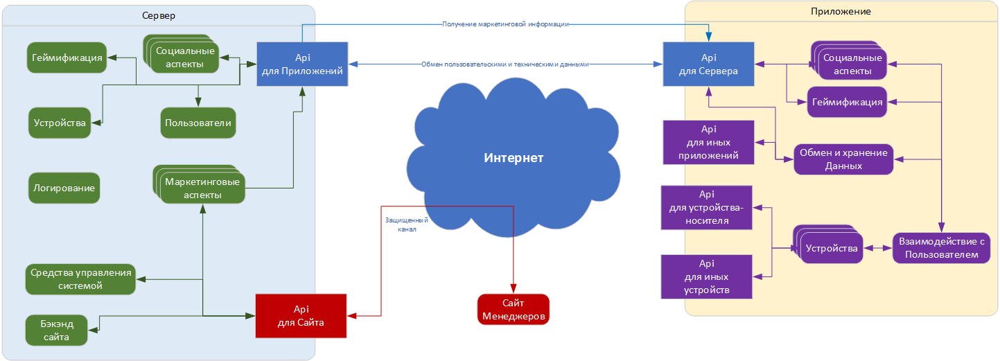

# Концеатуальная схема архитектуры

## Основные понятия
1. Речь идет о крайне распределенной и, весьма желательно, высоконагруженной системе. Потому в качестве основы - микросервисная архитектура, позволяющая максимально гибко адаптироватиться к требованиям и изменениям. 
2. Три основные части:
    1. Приложение. То, что видит пользователь и то, что взаимодействует с его устройствами.
    2. Сервер. То, что соединяет разных пользователей между собой, позволяет взаимодействовать с внешнеим миром
    3. Управляющий сайт. То, что позволяет менеджерам взаимодейсствовать с пользователями, выдавать ему предложения, рекламу и т.д. Здесь же мониторинг и управление системой.

3. В приложении ряд api, позволяющих работать с отдельными группами объектов:
    1. API для приложений и API для сервера. Парный набор api по клиент-серверным функциям Приложения и Сервера.
    2. API для управления - серверный api, используемый работы сайта для Менеджеров.
    3. API для устройства-носителя. Клиентский api для общения Приложения и телефона\планшета, на котором оно установлено
    4. API для внешних устройств. Клиентский api, используемый для общения с внешними устройствами, такими как умные браслеты, умные кроссовки и т.д.
    5. API для иных приложений. Клиентский api, включающий в себя набор функций по обмену информации с иными приложениями, как нашими, так и сторонними, ежели необходимо забирать информацию из них.

## Используемые цвета
1. Зеленые блоки - внутренние севрисы внутри Серверной части. Пряммого доступа через интернет к ним нет, только через GateWayApi. 
2. Красные - части внешней, но защищенной и контролиремой сети. Например, доступ с удаленного рабочего месте менеджера вне сервера, но только через VPN или иные защищенные технологии. В идеале простые пользователи даже теоретически увидеть эту зону не могут.
3. Синий - цвет открытой сети, эти блоки имеют доступ в общую неконтролируемую сеть.
4. Фиолетовый - как зеленый, только для Приложения.
---

<a href="05_risks.md">[Далее]
