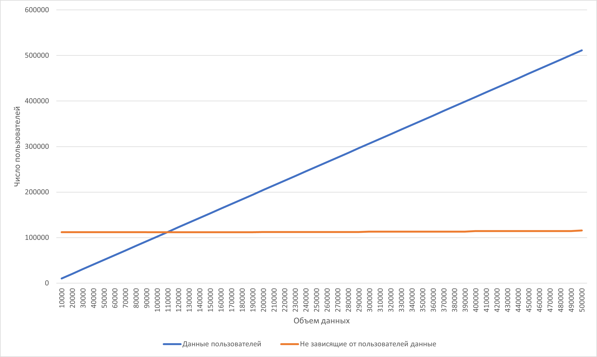
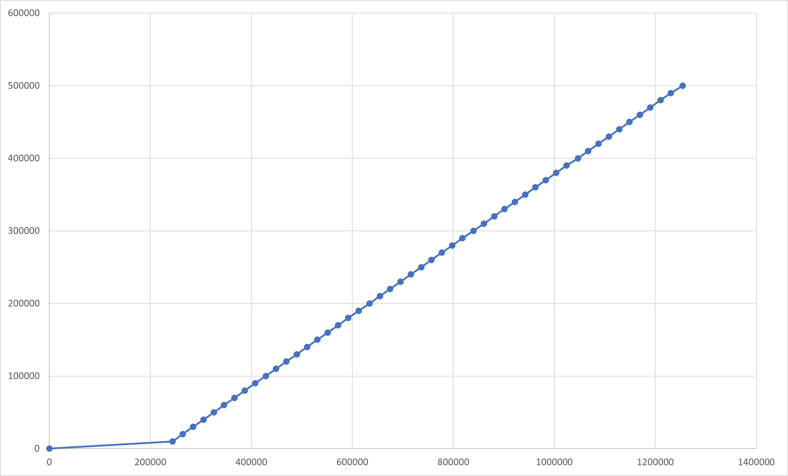

# Стоимость владения системой
## Основные предположения
1. Приложение не "взлетит" и будет где-то на средних-последних строчках популярности
2. Принято мнение разворачиваться на уже имеющихся площадках, без приобретения новых.

## Расчет стоимости инфраструктуры
1. Прямые затраты именно на софт и железо - околонулевые, ибо мы и так это закупили для других проектов. 
2. Косвенные - зависят от масштаба. Выделить еще одну виртуальную машину в кластере из 1000 - никто даже не заметит. В самом худшем случае - отожрут половину ресурсов. Средние затраты выделенный сервер - 
    1. 660000 рублей в год. 
        2 x Intel Xeon Silver 4210 2.2GHz (20 cores)
        128GB RAM
        2 x 1024GB SSD
        Канал 1 Гбит/с
    2. Предположим, у нас по 2 копии каждого сервиса (всего их 10) плюс очередь, итого 21 виртуальных машины. Тяжелых расчетов в них нет, только - подай-выдай из базы и сравни значение с диапозоном из базы (для достижений). По 2ГБ оперативной памяти - достаточно. 42ГБ оперативной памяти - меньше трети из сервера. SSD диски вполне достаточны по скорости для работы. Возможно, процессоров не хватит, и часть сервисов не именно вритуалками, а контейнерами, например. В любом случае - все поднимется. При исползовании трети ресурсов. Итого заложим средние затраты как треть от сервера (причем помним, что сервер в любом случае уже куплен, используется)
3. Сторонние специалисты не нужны, и так есть.
4. Сторннее ПО не нужно, все есть, чего нет - допишем в рабочем процессе.
5. Итого: затраты *220к рублей в год* на инфраструктуру

## Расчет стоимости БД
### За 1 год
Расчеты велись по открытым данным в интернете.
Так же важное уточнение: если запись описывает файл, значит вес этого файла учитывается в понятии "вес БД".
1. Софт и обслуживание - 0, т.к. берем бесплатные аналоги и уже имеющиеся мощности
2. Расчет данных:
    1. Картинок, видео, иных тяжелых ништяков не запланировано. 
    2. Предположим, 50% пользователей мобильных телефонов тем или иным образом пользуются фитнесс приложениями хотя бы раз в год. Согласно опросам, Примерно 17% от них имеют лидеры Apple Health. Предположим, что за год мы просто вошли в топ с 1% пользователей.
    3. Расчет ведем по России. Пусть 70% населения пользуются мобильными телефонами. 
        Это 147 182 123 × 0,7 = 103027486 человек. 
    4. Итого у нас:
        103027486 * 0.5 * 0.01 = 515137 пользователей
        Округлим до 500000 пользователей в течение года (уточнение, это те, кто зашел *хотя бы раз*)
3. Расчет веса данных в таблицах:
    1. Users - 1 Guid, 2 потенциально неограниченных поля, которые при всем желании не займут больше 10кб (никто не будет менять телефон тысячу раз), остальные string не больше 50 б. Итого 5108,8 Мб.
    1. UserLocation. 8 полей, 3 Guid, остальные string меньше 100 символов. 600 байт на запись. Минимум по 1 записи на пользователя. Пусть 50% пользуются им регулярно, хотя бы 3 раза в неделю. И маршрут состоит в среднем из 10 точек. Итого 
    500000 + 500000*0.5*3 + 500000*0.5*10 = 3750000 записей.
    2145,76 Мб.
    2. UserBackup: 7 полей,  3 id. Но к каждой записи приложен файл с настройками. Пусть он будет ОЧЕНЬ большой аж в 1Мб. Итого: 1Мб и 450 байт. Бекап - 1 на пользователя. Итого 500000 Мб. В реальности меньше
    3. Devices. Самое тяжелое - файл с настройками. Тут неизвестно, но пусть там еще и скриптов на 10Мб (они с картинками). Запись в БД при этом несущественна, пусть 10кб. Сколько устройств будет поддерживаться - неизветно, но пусть 10000. Итого: 97,65625 Мб на базу и 100000 Мб на настройки. Итого - 100100Мб с округлением.
    3. DeviceUser - по 2 устройства на пользователя (то, на котором он установил приложение и фитнесс-устройство). 10 полей: 3 guid, 2 даты, 2 логических и 3 коротких string. 3кб максимум. Итого (3 * 500000) / 1024 = 1464,84375 Мб.
    4. Topics - пусть на форуме будет создано 1000 тем. Что весьма маловероятно, на форумах сейчас мало кто сидит, предподчитает каналы. 
    Вес одной - из-за Description может быть до 100кб, если описание ОЧЕНЬ большое. 97 Мб.
    5. TopicRights - пусть на каждой ветке по 10 забаненых, 1 создатель и 4 модератора. Итого 15 записей на каждый Topic
    Вес одной - 1кб. Всего - 14,6 или 15Мб.
    6. TopicRecord. Пусть очень поулярны все темы - по 100 записей в каждой. Итого, из-за потенциально неограниченного Text - пусть по 100кб на запись. Итого примерно 100Мб.
    7. Chats и подтаблицы - примерно как темы форума, только по умолчанию в разы легче по содержимому. Для легкости сделаем эквивалентным с форумами. 
    8. Самое тяжелое в GameAchivement - картинки. Пусть будет 200 разных достижений (а их будет меньше). Картинка в 200кб - весьма качественна и достаточна для мобильного приложения. Запись на каждую - не больше 10кб, и то, только за счет потенциально неограниченного описания.
    Итого: 41Мб
    9. GameUserAchive - пусть ситуация будет благосклонна и ВСЕ пользователии получат по трети возможных достижений. Запись занимет 80б. Итого 2543 Мб.
    10. SportGroups, потенциально, сравнимы с чатом. Скорее всего, пользоваться им почти не будут. Для уверенности предположим, что будет по размеру как чат и форум.
    11. Market. Из тяжелого - изображения, которые могут быть анимациями или видео. Пусть по 10Мб на 1 запись. Не будут же гиговые видео в рекламы пихать... Пусть по 3 новых рекламы в день. Итого 1095 записей. Это займет примерно 10952 Мб дискового пространства.

    Итого: *617883 Мб* или около *618 Гб* за 1 год.
    Из них львиную долю (500Гб) занимают записи о полумиллионе пользователей и бекапы их данных. 
    И это взято в очень грубом округлении в очень большую сторону. 

### За 2 год
Пусть число пользователей удвоилось (что невозможно, но мы оптимисты)
За 2 год в БД потребуется *1236 Гб*. Тоесть у нас уже аудитория в 1 миллион пользователей.

### За 5 год
Будем хоть немного реалистами, взрывной рост популярности приложения прошел, теперь рост идет на 25% в год. 
На 3 год - 1236 Гб * 1.25 = *1545 Гб*
На 4 год - 1545 Гб * 1.25 = *1931,25 Гб*
На 5 год - 1931,25 Гб * 1.25 = *2414,0625 Гб*.

### Итого
Итого 2,5 Тб пользовательских данных за 5 лет. Плюс еще столько же на техническую информацию (логи). Итого 5 Тб информации.
6 на всякий случай, бекапы лишними не будут.

При средней стоимости у облачных сервисов в 60$ на 6 Тб дискового пространства в месяц, в перерасчете на год - затраты около 720 долларов на год или 3600 за 5 лет, если купить все пространство сразу. Но мы помним, что диски пространство-то у нас и так есть, а 6 Тб в перерасчете на корпорацию - очень небольшая цифра. Один жесткий диск в сервере. 

Причем напомню, все цифры ОЧЕНЬ завышены. Реальные значения будут на порядок меньше, да и наполняться будут очень постепенно. 

## Итого
1. За 1 год: 220к + 720 * 94 = 287680 рублей
2. За 2 год: 287680 * 2 = 575360 рублей
3. За 5 год: 287680 * 5 = 1438400 рублей
Важно помнить: это не прямые затраты *вынь да положь*, а косвенные, заключаемые в отторжении части ресурсов у иных систем. 
Потому в графе "стоимость владения" будет стоять 0, но дополнителная нагрузка на железо, обслуживание, отвлечение внимания специалистов - все это приведет к увелечению стоимости владения теми системами, что послужат донорами.

## Расчет стоимости на 10000 пользователей
### База Данных
1. Ряд таблиц, например, Устройства, от количества пользователей не зависят. Остальные же перерасчитываем на 10000 пользователей:
    (5108,8 + 2145,76 + 500000 + 1464,84375 + 2543) / 500000 * 10000 = 10225 на 10000 пользователей. 

2. Форум, чат, групповые занятия оценить очень сложно. Если предположить, что там общается и так не более 10% от общего числа пользователей, причем чем раньше они пришли, тем больше шанс, что будут реально писать, а не читать уже готовые темы (ибо всё уже давно спрошено и отвечено, зачем еще раз темы плодить), считаю, что эти значения можно не перерасчитывать (они и так смешные)

3. Итого:
    1. Неизменяемые БД: 
        100100 + (97 + 15 + 100) * 3 + 10952 = 111688 Мб
    2. Пользовательские на 10000:
        10225 Мб
    3. Имеется вероятность, что размеры форума, чата и спортГрупп будут расти выше имеющихся значений. Но даже при ошибке в активности в 100 раз их размер будет меньше всего одного раздела с Устройствами, потому этим можно пренебречь. Тем не менее, предположим, что каждые 100000 пользователей общение увеличивается на 50%. 
    4. 
    По графику четко заметна тенденция: после 11к пользователей влияние роста непользовательских таблиц на общий объем данных становится весьма мал. И чем дальше, тем больше разрыв. 

### Финансовый вопрос
#### По железу 
1. Выше был расчет, и он и так минимальный: 2 копии - вопрос безопасности и стабильности, а не производительности. В любом случае, затраты на железо что в 10к пользователей, что в 500к будут эквивалентны: один нормальный сервер справится. 
2. Да, к 500к будут явно видны подтормаживания и подвисания относительно пустого сервиса. Но этот тренд будет заметен гораздо раньше, чем наступит час "жопа", времени на реакцию достаточно.
3. У нас нет "тяжелых" сервисов, это просто "запиши-отдай" данные. Большая часть функционала работает внутри Приложения. 

Итого: без изменений, 220к в год.

#### По БД 

Примернывй объем БД относительно числа пользователей с учетом логов, бекапов и т.д. (логи и бекапы занимают столько же места, сколько и сами данные.)
1. На 10000 пользователей понадобится около 250Гб. Такой объем имеет любой уважающий себя сервер. Цены весьма различны, у гуглДрайв - $10 в месяц. Рост нелинеен. Дальше чем больше обьем, тем меньше цена за 1 условный гигабайт.
2. Отметки в 1Тб база достигнет при, ориентировочно, 350к пользователей. А это - $7 в месяц у Amazon.
Потому, возможно, выгоднее будет сразу выкупить большой объем, чем ограничиваться малым. Зависит от предложения на конкретном рынке в конкретный момент времени под конкретные требования. 
3. Возможен существенный рост цены при разбиении БД на несколько провайдеров для разных стран, локаций и т.д. Имеет смысл обсуждать только при серьезном интересе пользователей. 
4. Как бы странно это не звучало, но цена владения системой при 10к пользователей и при 500к пользователей разница не так уж и сильно.
5. Возможны нюансы при большом числе пользователей в вопросе обработки запросов.
    1. Одновременно они в сеть стучаться не будут. Все запросы - только в момент активности приложения. 
    2. Запросы не тяжелые. Данных ходят небольшими пакетами и не занимают много вычислительных ресурсов. Отдай записи форума с такой-то по такую-то даты из такой-то ветки. Чуть тяжелее с чатами, там пакеты в обе стороны должны летать часто, но их размеры крайне малы. 
    3. Вышеописанного сервера вполне хватит. Даже если в сутки приложением будут пользоваться треть от всех установивших (166666 пользователей при 500000) - это не больше 333332 запросов (при входе в приложение и при окончании тренировки). Получить свежую рекламу и синхронизирровать бекап пользовательских данных, если что изменилось (новое достижение заработал). Плюс на форуме может полазить: каждому по 3 запроса на 3 страницы, причем часть данных уже в кеше приложения, прислать по 5 сообщений с момента последнего обновления. И все эти запросы равномено растянуты во времени. С экстремумами в "часы пик" тренировок, но даже не будет и 100000 одновеменных подключений. Даже 10000 одновременных - это весьма сладкий миф. 