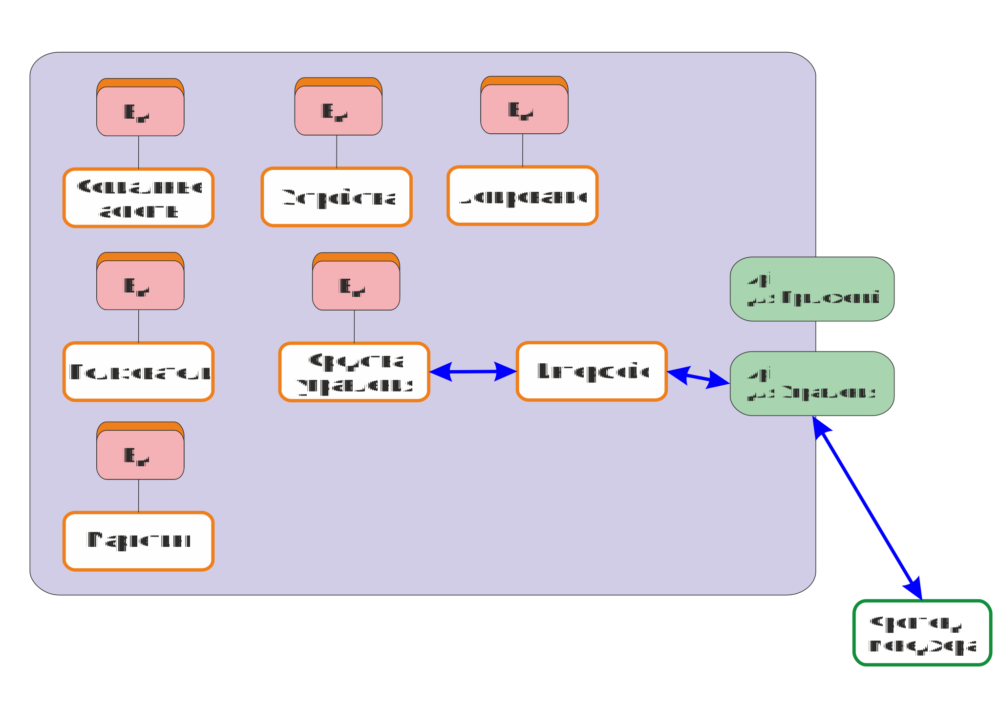

# Концптуальная архитектура сервера
## accepted

### Контекст
Необходимо продумать архитектуру сервера, позволяющую реализовать [Требования](../Task.md#требования) с учетом [вышестоящего](0001.md) решения.

### Решение
Микросервисная архитектура, каждый сервис - в рамках сложности и необходимости

### Причины
1. Максимальное удобство работы с учетом наличия широкого круга технологий, специалистов и т. д. 
2. Возможно, часть сервисов можно переиспользовать.
3. Максимальная производительность
4. Наверняка уже отлаженные механизмы по развертыванию таких систем на конкретных инфраструктурах, что решает большую часть трудностей по входу в эту архитектуру.

### Последствия
1. Возможная солянка в сервисах, если их будут писать разные команы
2. Куча точек "частичного" отказа, когда система вроде и живая, но не работает
3. Любые межсервисные взаимодействия - вероятные сетевые проблемы

### Проверка соответствия
1. Каждый модуль можно запустить отдельно, в нескольких экземплярах, система микросервисов работает, выполняет возложенные задачи

### Заметки
#### Автор
ЧДР
#### Дата принятия
26.07.2023
#### Кем принято
ЧДР

### Комментарии