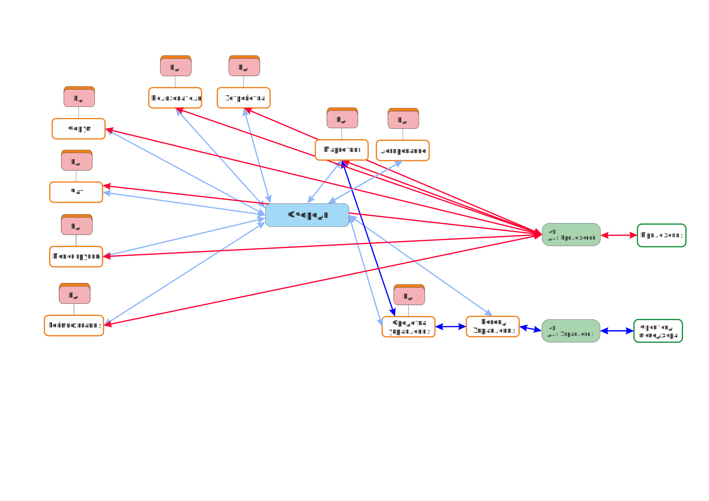

# Текст защиты проекта

## 1. Введение
Добрый день, уважаемые эксперты.
Меня зовут Черемисин Денис Романович, я рад представить Вам свой итоговый проект по курсу "Ахитектор програмного обеспечения".
Темой его является классичесчская "Разработка приложения для транснациональной компании по производству спортивных товаров".

## 2. Постановка задачи
Основные условия, поставленные в задании:
1. Реализация социальных компонентов в приложении.
2. Геймификация
3. Поддержка сторонних устройств

Что мы имеем до начала работы:
1. Есть ряд приложений, интеграции с которыми обязательны (как наших, так и чужих)
2. Есть широкий ряд специалистов разных направлений (разработчиков, девопсов и т.д.)
3. Есть ряд уже реализованных и поддерживаемых продуктов
4. Большая часть этих сервисов - в облаках, одного предподчтения нет

## 4. Бизнесс-цели и требования пользователей
Что нам надо реализовать, тоесть что хочет добиться бизнесс:
1. *Приложение, повышающее приоритет нашим товарам*.
2. *Приложение, позволяющее интегрировать другие устройства, в том числе и фитнесс-возможности мобильных устройств*
3. *Приложение, позволяющее интегрировать продающие элементы с других приложений компании*
4. *Приложение, имеющие функции социальной сети*

Звучит масштабно. Теперь попробуем перевести это с формального на русский
1. Реализация социальных компонентов в приложении, включая форумы, чаты, поиск групп и т.д.
2. Геймификация, включая инвентарь, достижения и т.д.
3. Интеграцию фитнесс-возможностей смартфона и внешних устройств
4. Внедрение "продающих" компонентов

## 5. Для кого и что
Очень важно, для кого мы это разрабатываем и что они хотят.
1. Владельцы бизнесса. Им важны только деньги. Прибыль. На всё остальное - плевать.
2. Управляющий менеджмент. Деньги, отчетность, репутация. Они - наёмный персонал и от показаний фирмы зависит их зарплата. Первая, третья и четвертая заддачи отвечают пожеланиям группы. Тем не менее, важно учеть требования в отчетности и заранее заложить некоторые механизмы контроля и визуализации "для красивой картинки".
3. Рядовой менеджмент. Личные продажи. Им плевать на все, кроме того, что идет к ним в план. Их хотелки максимально будут направлены в желание "пропихнуть больше рекламы" и "заставить юзеров больше покупать". Максимум прислушиваться с точки сзрения удобного управления системой, но никак не внедрять все их хотелки. Первая и четвертая задачи частично отвечают их хотелкам. 
4. Пользователь. Ему реклама не нужна. Ему интересны "фишки", функционал. У бизнесса нет цели сделать "фишку", потому очень важно отыскать баланс между бизнессом и пользователем. Ибо "фишки" очень дороги.
5. Разработчики. Кто-то эту систему должен поддерживать и сопровождать. Вот на это бизнессу точно плевать. Это ж денег стоит. Потому заранее необходимо заложить инструмены и способы работы системой и замаскировать их под "отчетность" для руководителей.  

## 6. Концептуальная архитектура

3 части: сервер, приложение, сайт. 

## 7. Риски
Как говорил Полковник Мерфи, если что-то может пойти не так - оно обязательно пойдет не так.
В условиях нашей задачи не так может пойти по двум путям: бизнесс и техника.
На слайде краткий список тех рисков, что могут возникнуть. И красным выделен основной и тот, вероятность чьего возникновения приближается к единице: приложение "не зайдет". На это указывает статистика фитнесс-приложений, рынок которых хоть и растет, но лидеры весьма грозно сверкают со своих вершин, не допуская до своей области конкурентов. Увы, без нормального бизнесс-аналитика мне крайне сложно сказать, что именно нужно реализовать, чтобы продукт зашел. В одном уверен - это будет ОЧЕНЬ дорого по времени и специалистам.
Я, как архитектор, вынужден признать, что эта работа, весьма вероятно, будет убыточна и, даже, как маркетинговый ход не особо успешна. Причины:
1. Во время пандемии произошел всплеск интереса к спорту на дому. Свободных пользователей крайне мало, а сманить - сложнее.
2. ОГРОМНОЕ разноообразие приложений на любую специализацию. А у нас - комбайн. Мы не сможем сделать такой огромный механизм, чтоб он каждоц своей частью был удобнее, мощнее и выгоднее, чем узкоспециализированное и уже известное приложение. Ну разве что вложить ОЧЕНЬ много денег. 
3. Само по себе приложение бдет получать аудиторию только случайно и очень медленно. Нужны очень немалые маркетинговые вливания. Реклама, включение в инструкции, заказ блогеров. Тоже очень дорого.

Итого: это будет или ОЧЕНЬ ДОРОГО, или МИНИМИЗИРОВАТЬ УБЫТКИ.
Этот момент должен будет решить бизнесс. Я склоняюсь к мнению, что к таким затратам он не готов.

## 8. Архитектурные опции
1. Микросервисы как способ построения сервера
2. Структурированный монолит с возможностью интеграции плагинов для Приложения. Кроссплатформенная разработка.
3. Облачные сервисы. Причем уже имеющиеся.
4. База SQL.
5. МАКСИМАЛЬНОЕ заимствование готовых сервисов.

## 9. Итоговые схемы

## 10. Представления
1.	Информационное
2.  Многозадачности
3.	Безопасности

## 11. Компромиссы
1. Если не скажут обратного бизнесс-аналитики, приложение не взлетит. 
    1. Необходим баланс между минимальным функционалом и минимальными затратами. Чем больше времени и сил на функционал - тем больше средств нужно затратить. Чем больше ресурсов выделять - тем больше денег это стоит. 
    2. При прочих равных - выбирать всегда "подешевле".
2. Очень много кейсов уже было решено в рамках других проектов, потому взять уже готовую реализацию - дешевле и выгоднее. Там основные этапы разработки уже пройдены. С другой стороны - зоопарк технологий и систем. При возможности выбора - придерживаться одной технологии.
3. Разворачивание системы проводить постепенно, начиная с одной самой экономически выгодной страны. 
    1. Юридически не будет проблем подогнать систему под требования кокретного законодательства
    2. Маркетинг более точно настроен на нужную аудиторию
    3. Если вдруг взлетит - расширить в одном месте легче, чем сразу в 10
    4. Много потенциальных клиентов не получат своего "ништяка", например поддерживаемого языка. Или вообще не увидят приложения. Но, учитывая компромис 1, и так не увидит. 

## 12. Риски
Концептуальные, бизнесс и инфраструктрные.
Концептуальные - микросервисы. Как ни крути, отдельный сервис - отдельная проблема, плюс каналы связи между ними.
Бизнесс - если все же взлетит, надо переделывать в сторону большей защищенности. Нужно слово аналитика.
Инфраструктура - поднятие в режиме "что-где" может быть выгодным финансово, но тяжело по поддержке. 

## 13. Цена
При идеальном старте в 500000 в 1 год:
618 Гб.
1236 Гб
На 3 год - 1236 Гб * 1.25 = *1545 Гб*
На 4 год - 1545 Гб * 1.25 = *1931,25 Гб*
На 5 год - 1931,25 Гб * 1.25 = *2414,0625 Гб*.

Плюс столько же на логи.

На 10к  юзеров:
10225Мб

плюс системные
111688 Мб

Удваиваем на логи.

Железо
220к рублей в год

Цена
1. За 1 год: 220к + 720 * 94 = 287680 рублей
2. За 2 год: 287680 * 2 = 575360 рублей
3. За 5 год: 287680 * 5 = 1438400 рублей

## 14. Вывод
1. Система, могущая быть быстро адаптированной. 
2. Система, на начальном этапе создаваемая с минимальными издержками.
3. Система, могущая быть развернута в любом регионе и под любой контингент.